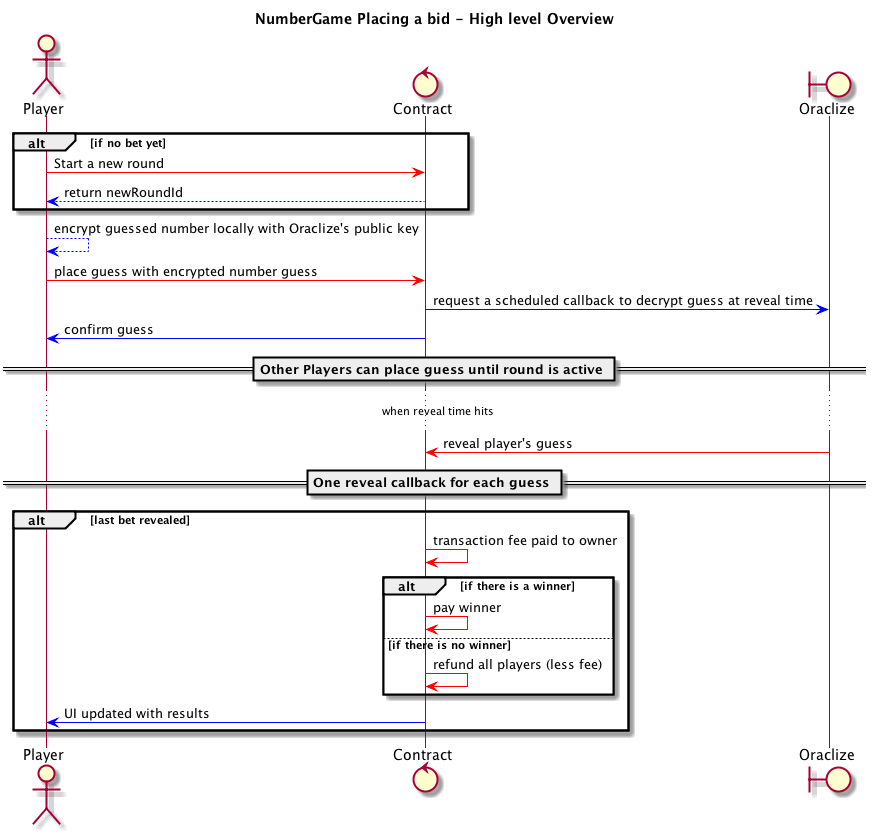

# numbergame
Decentralised Smallest Number Game on Ethereum

Play a game where each player sends one positive integer in a game round, with a fixed 'bet' amount. The player who sends a unique and smallest number wins the pot. This means if two people happen to send the same number, then the third one gets all the bets regardless the other two number were smaller.
If there is no winner (ie. there is no unique number in the round ) then all players get back their bet.  
What number would you put if you were to play this game?

NOTE: It's a work in progress project: there are plenty of TODO and some open questions. Check it below and the comments in code.

Contribution, code review and suggestions are welcome!

## Game Mechanics
1. A round is initiated by the first player. And be closed in a future time (closing date).
1. Players submit their guess: a positive integer number for the round. A pre-defined guess amount is included to have a stake in the game.
1. At the closing date, the round stops accepting further bets and a winner is selected. The winner is defined as the one who picked the lowest number that nobody else has picked.
1. At game close the organizer takes a pre-defined fee.
   * If there’s a winner, the contract disburses all remaining funds to the winner.
   * If there’s no winner, the remaining funds are disbursed to the participants.

## Technical implementation - First pass approach
Participants send their bet to a 3rd party ([oraclize.it](http://www.oraclize.it/)) which encrypts it with it’s own secret key. The encrypted version of the bet is sent in to the contract. At a given time  - which is specified at the beginning of the round - the 3rd party starts revealing the clear-text bets, one by one. After all bets are revealed, the round is closed.


See also: [Detailed Sequence Diagram](docs/numberGame_sequenceDiagram.png)

There are a number of known issues with this approach. See ongoing discussion in wiki about potential [alternative solutions](https://github.com/szerintedmi/numbergame/wiki/Alternative-approaches) to keep bids secret until end of the round.

## Dev environment
### Prerequisites
* [Ethereum CLI](https://www.ethereum.org/cli)
* [nodejs](https://nodejs.org/en/download/)
* [node version manager](https://github.com/tj/n): `npm install -g n`
  * install 6.9.1 for ethereum-bridge: `n 6.9.1`
  * install latest (tested with 8.0.0):  `n latest`
* [numbergame repo](https://github.com/szerintedmi/numbergame):
```
git clone --recursive https://github.com/szerintedmi/numbergame.git
cd numbergame
npm install
cd ethereum-bridge
npm install
```
* [testrpc](https://github.com/ethereumjs/testrpc) (global): `npm run testrpc:install`
  * if you want to run testrpc in a [docker](https://store.docker.com/search?type=edition&offering=community) container:  
`npm run testrpc:docker:build`
* [truffle](http://truffleframework.com/docs/getting_started/installation) (global): `npm run truffle:install`

### Compile & deploy & run
#### on testprc
```
npm run testrpc:start
npm run bridge:start
npm run truffle:migrate
npm run dev
```
[Detailed deploy instructions](docs/deploy.md)

* An improved and customized [Ethereum explorer fork](https://github.com/szerintedmi/explorer) if you want to browse the local chain:  
`npm run explorer:start`

TODO:
 * When contract .sol changed then both testrcp and ethereum-bridge need to be restarted. Truffle migrate won't deploy the new version.
 * dockerize (Dockerfiles + docker-compose config)

## Testing
TODO: write unit tests

## Licence
This project is licensed under the Apache 2.0 License - see the [LICENSE](LICENSE) file for details.
